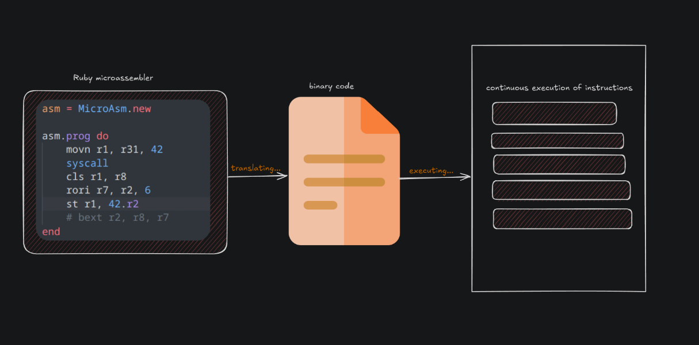
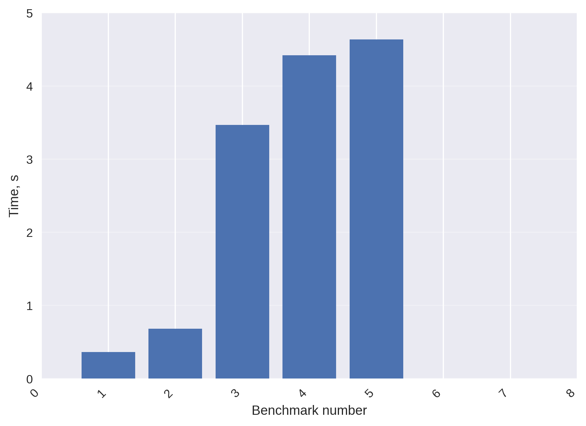
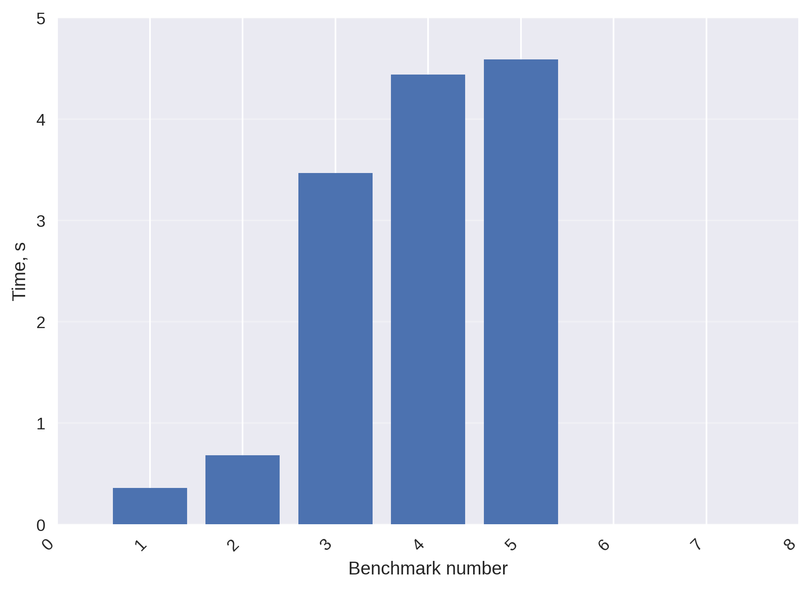
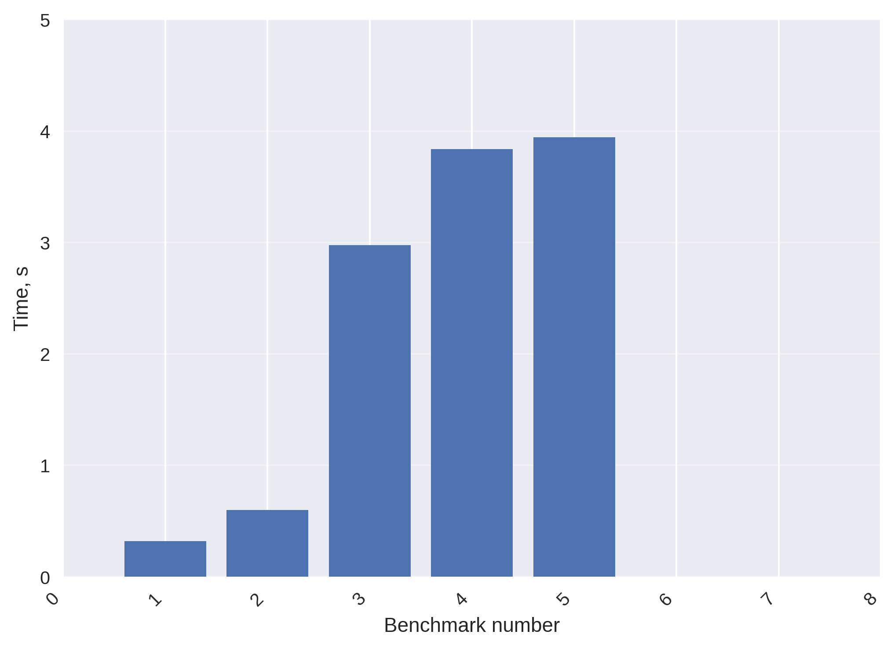

# TOY ISA (interpreter)


#### HOW TO USE (clone (🤡) these commands)

```
git clone https://github.com/Barkir/ToySim
```
```
cd ToySim
```

_make sure you're in root dir of this repo_

```
chmod +x ./get_ready.sh
./get_ready.sh
```

### ⚠️⚠️⚠️ WARNING
- Before writing the code on microassembler - **plz** install only 1 variable. Here's the instruction.
1. `cd build`
2. `pwd` and copy it
3. Go to constants.rb
4. Find `TOY_SIM` constant and clear it
5. Insert the path of `ToySim` that you copied


## MicroAssembler
I use [ruby](https://www.ruby-lang.org/en/) for writing microassembler.

On the first commits you can see that I used it kinda differently (as a parser, not as a microassembler).

The clue is we don't need to write a parser itself, because Ruby's syntax allows us to call class methods in the way we call assembler instructions

For example, the function can be called in two ways

```ruby
movn(r1, r31, 42)
```

```ruby
movn r1, r31, 42
```

Those are equal! So `movn` is just a method of the class called `MicroAsm` which you can look at [here](./toy_isa.rb)

#### Commands

| Command | Notes     | made it (both in asm and interpreter) |
|---------|-----------|---------|
| movn rd, rs, rt    | if (rt) then rd = rs                 | ☑️        |
| add rd, rs, rt     | rd = rs + rt                         | ☑️        |
| subi rt, rs, imm   | rd = rs - imm                        | ☑️        |
| jmp t    | pc = pc + t                                    | ☑️        |
| cbit    |                                                 | ☑️        |
| beq rs, rt, offset     | if (rs == rt) pc = pc + offset   | ☑️        |
| bext    |                                                 | ☑️        |
| ldp     |                                                 | ☑️        |
| ld      |                                                 | ☑️        |
| cls     |                                                 | ☑️        |
| rori    |                                                 | ☑️        |
| st      |                                                 | ☑️        |
| xor     |                                                 | ☑️        |
| syscall | r8 - system call number, r0-r7 - args, r0-result| ☑️        |

#### Ruby features
1. A class has default methods.
    - `initialize` - a method which initializes some sh...
    - `method_missing` - handles the situation when some method is missed in a class


**This is a usecase for `method_missing`**

I got `st` instruction in microassembler

Its' syntax - `st rt, offset(base)`

`offset` is a number and `base` is a base register.

so, we call it like this `st r1, 42(r2)`

In Ruby we can call it like this `st r1, 42.r2`

HOOOOOOW?

`42` is an object of `Integer` class. And then we call a method of it called `r2`. But we don't have such method by default, so we can define it with `method_missing` method.

Here's how I made it.

```ruby
class Integer
    def method_missing(name, *args)
        if name.to_s =~ /^r([1-9]|[12][0-9]|[3][01])$/ && args.empty?
            return {offset: self, base: name}
        end
    end
end
```

`/^r([1-9]|[12][0-9]|[3][01])$/` looks frightening.

It means that if our method starts from `r` and it has

```
numbers from 1 to 9

or

numbers 1,2 as the first one and 0-9 as the second one

or

number 3 as the first one and 0,1 as the second one
```


It mathes our case and we return a dictionary where we contain our object and the **name** of this _fictional_ method as a string.

## Simulator

This is a brief structure of simulator

| File | Desc |
|------|------|
| [commands.cpp](src/commands.cpp) | implementations of instructions (`callCBIT, callCLS etc.`), dumps|
| [interpeter.cpp](src/interpreter.cpp) | get commands from binary file, init function with big instruction switch |
| [commands.hpp](include/commands.hpp) | function declarations, constants (opcodes, sizes, offsets), `MemorySPU` and `Instruction` classes |
| [interpretep.hpp](include/interpreter.hpp) | function declarations |
| [errors.hpp](include/errors.hpp) | errors declarations, esc-colors for dumps|

## Performance Analyzing
If you want to test performance of `ToySim` on your device - you can run `run_benchmarks.sh`

It runs `perf` and `hyperfine`, then stores the data in folders with the same names and creates a graph using `build_plot.py` which is stored in `images` dir.

### Some Results

|#| Big Switch | HashTable |
|-|--------|-----|
| 1|| |
| 2 | | |
| 3 | | |

## TODO's

| #   | Task                         | Description                                                                                                    | Status |
| :-- | :--------------------------- | :------------------------------------------------------------------------------------------------------------- | :----- |
| 1   | Make a class for instruction | Should include methods for getting `rs, rd, rt` registers.                                                     | ✅      |
| 2   | Make 1-byte addressing       | Change from 4-byte addressing to 1-byte addressing.                                                            | ✅      |
| 3   | SignExtension for offset     | Used to handle jmp back (Ref: `commands.cpp:134`).                                                             | ✅      |
| 4   | Function for CBIT            | Implement the CBIT function (Ref: `commands.cpp:150`).                                                         | ✅      |
| 5   | Remove char's                | Refactor code to not use `char` types (Ref: `commands.cpp:173`).                                               | ✅      |
| 6   | Implement CLS, RORI, ST      | Write the functions for `CLS`, `RORI`, and `ST` instructions.                                                  | ✅      |
| 7   | Refactor BEXT function       | Clean up the `BEXT` function (Ref: `commands.cpp:161`).                                                        | ✅      |
| 8   | Change to Little Endian      | Switch from big-endian to little-endian (Ref: `toy_isa.rb:201`). Delete `swapEndian` function in `.cpp` files. | ✅      |
| 9   | Assert on symbol             | Add an assertion for a symbol (Ref: `toy_isa.rb:211`).                                                         | ✅      |
| 10  | Refactor operand parsing     | Use a method for `[operand[:offset], operand[:base].to_s.delete(":r").to_i]` (Ref: `toy_isa.rb:333`).          | ✅      |
| 11  | Class for memory             | Make a class for memory.                                                                                       | ✅      |
